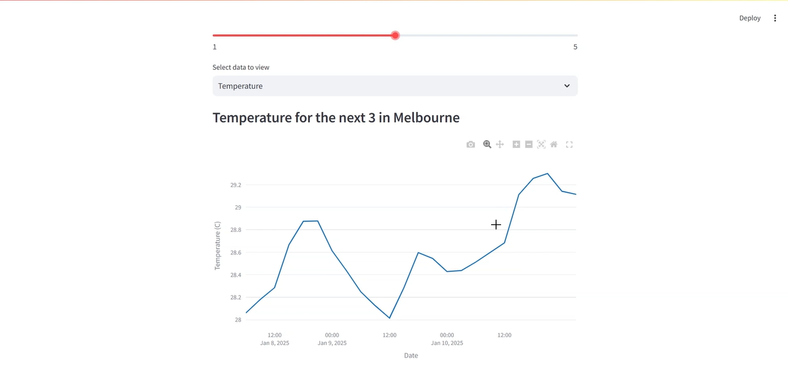
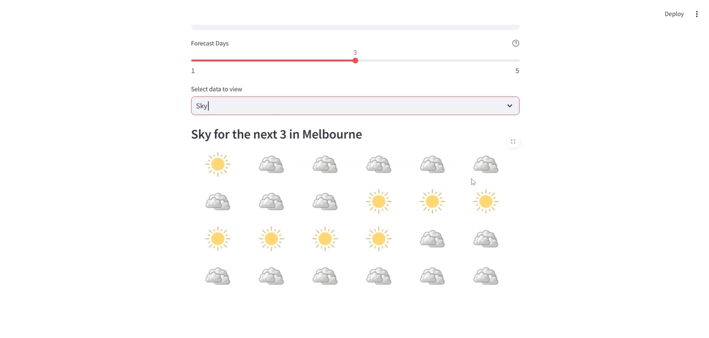

# 🌦️ Weather Forecast Webapp

A **Streamlit**-based web application that provides weather forecasts for any location. This app uses the **OpenWeatherMap API** to fetch real-time weather data and displays it in an interactive and user-friendly interface.

---

## 🛠️ Features

- **Location-Based Forecast**: Get weather forecasts for any city or place.
- **Customizable Forecast Period**: Choose forecast periods from 1 to 5 days.
- **Interactive Visualizations**: View temperature trends using **Plotly** charts.
- **Sky Condition Display**: See sky conditions (e.g., Clear, Clouds, Rain) with corresponding images.

---

## 🚦 How to Use

1. Install the required dependencies (`streamlit`, `plotly`, and `requests`).
2. Run the Streamlit app using the provided script.
3. Enter a location, select the forecast period, and choose to view either temperature or sky conditions.

---

## 📸 Screenshots

---

## 🎥 Demo

---

## 📬 Contact

Feel free to explore the project and share your feedback. For any inquiries, suggestions, or contributions, reach out to me at **sathiyanarayanan.s1698@gmail.com**.
